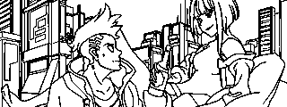
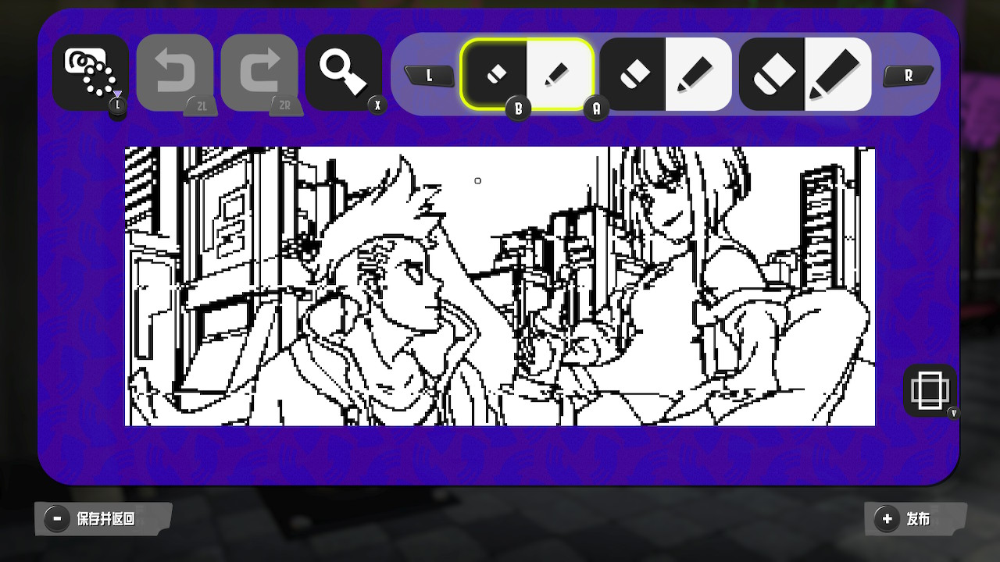

# Switch-Fightstick
Switch-Fightstick is a Golang application that turns a USB gadget into a simulated Switch Pro Controller. This allows you to use your computer or any other linux device as a Switch Pro Controller for playing games on your Nintendo Switch or other devices that support the Switch Pro Controller.

## Features

Switch-Fightstick currently supports the following features:

- Simulated Switch Pro Controller functionality
- Draw picture for Super Mario Maker 2 and Splatoon 3

## Getting Started

Create Nintendo Switch Pro Controller USB Gadget first.

e.g. [https://gist.github.com/mzyy94/60ae253a45e2759451789a117c59acf9]()

